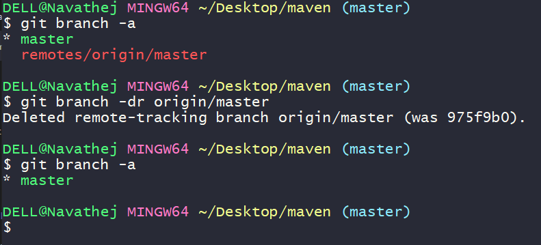

To delete Remote branches from locally
----------------------------------------
1. when we perform git fetch command it will create a remote branch in to our local system  that will visible

    $ git branch -a

2. To remove those remote branches from our local machine 




=======================================================

To delete a remote Git branch, you'll use the `git push` command with the `--delete` option. Here's the general syntax:

```bash
git push <remote_name> --delete <branch_name>
```

Here's a step-by-step guide:

1. **List Remote Branches**:

   First, you should list the remote branches to identify which branch you want to delete. You can do this with the following command:

   ```bash
   git ls-remote --heads <remote_name>
   ```

   Replace `<remote_name>` with the name of your remote (e.g., `origin`).

2. **Delete the Remote Branch**:

   Once you've identified the branch you want to delete, use the following command to delete it:

   ```bash
   git push <remote_name> --delete <branch_name>
   ```

   Replace `<remote_name>` with the name of your remote (e.g., `origin`) and `<branch_name>` with the name of the branch you want to delete.

   For example, if you want to delete a branch named `my_branch` on the `origin` remote, you would run:

   ```bash
   git push origin --delete my_branch
   ```

   After running this command, the branch will be deleted from the remote repository.

3. **Remove the Local Tracking Branch (Optional)**:

   If you want to remove the local tracking branch that corresponds to the deleted remote branch, you can use the following command:

   ```bash
   git branch -dr <remote_name>/<branch_name>
   ```

   For example, if you deleted `my_branch` on the `origin` remote, you would run:

   ```bash
   git branch -dr origin/my_branch
   ```

   This command will remove the local tracking branch associated with the remote branch.

Please be cautious when deleting branches, especially on shared repositories, as it can't be undone. Always make sure you're deleting the correct branch.