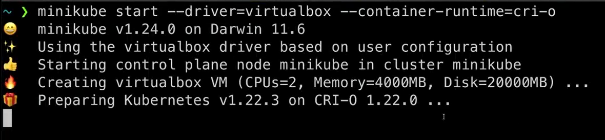
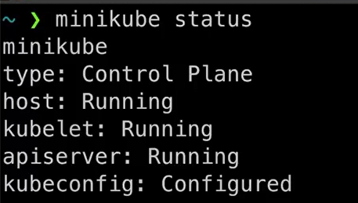
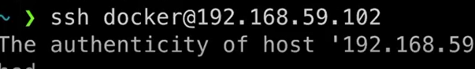
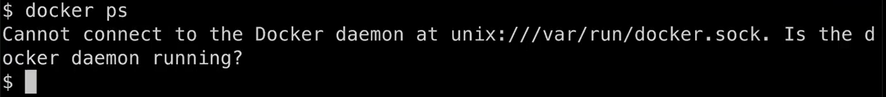
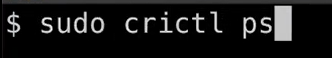

Course plan
-------------
1. terminalogy and features of the kubebenetes
2. create a kuberenetes cluster with minikube
3. create scale deployments
4. building custom image and create deploymets using published image
5. create a services and deployments using yamls files
6. change containers runtime from docker to CRI-O

------------------------------------------------------------
# Kubebenetes will take care of 
1. automatic deployments of the containerized applications across differet serveers
2. it supports distributed of the load across multiple servers
3. autoscale of the deployed applications
4. it will monitor health check of the containers 
5. it will replace failed containers

--------------------------------------------------------------

# Pod
pod is the smallest unit in the cluster of k8s
pod contain container and shared volumes shared ip address ( in most cases only one cotainer for one pod but some cases pod may containe multiple containers )
in k8s cluster there are master node and worker node 
master node will distribute load to worker node it will not load on itself 
but master node container few services those will take care of to place pod on workers nodes in the cluster
by default in the k8s cluster master node and worker nodes containes few services which are ( kubelet, kube-proxy, container runtime these are the default services in the cluster ) 
But only present services on the k8s master node
# Master machine Services 
1. KubeAPI server service ( it is the main point of commuication butween master nodes and worker nodes  ) ( and also kubeproxy is available in the cluster on each nodes it is responsible for network communication between nodes and inside node)
2. Kube Scheduler services server ( it is responsible for place pods on nodes in the k8s cluster ) 
3. kube controler manager services server ( it will single controller everything in the k8s cluster  it controlles what happend in the cluster )  
4. cloud controller manager ( it will get know whare we are k8s cluster are runing ) 
5. etcd service server ( here it will stores all logs related to k8s cluster it will containe metadata related information in the cluster )
----------------------------------------
# Kubectl
from above master services main services are Kube API service it will manage entire k8s cluster using kubectl tool 

kubectl it is a seperate tool
kubectl help to allow k8s cluster and manage k8s cluster remotely    
kubectl connection happens using https service 
kubectl can installed local machine and manage k8s cluster remotely 

=============================================================

# Note1: 
using kubectl tool we can manage k8s cluster even remotely also using kubectl tool we can connect using Rest API to API server service sucu communications happens using https and also other workers nodes in the cluster communicate with master node with same way only 

# Note2: 
k8s cluster containe one master node and worker nodes pods can be deployed in the worker nodes pods are smallest usint in the k8s cluster pod containe contaiers ( in most cases single containers only it might be multiple containers also ) inside pod conatiners share ip address and volumes of the pod 

# Minikube Setup on local machine 
Link: https://github.com/thej950/devops-notes/blob/main/Kubernetes/extras/minikube%20installation%20in%20ubuntu.txt 

============================================================

# Namespace in k8s
1. default Namespace
2. kube-node-lease Namespace
3. kube-public Namespace
4. kube-system Namespace

    $ kubectl get pods --namespace=kube-system 
    
( above commads show system pods these places on master node  those are place inside kube-system Namespace )

=======================================================
Kubectl Basic commads
----------------------
    $ kubectl run mynginx --image=nginx ( this command will run nginx container inside k8s cluster)
    $ kubectl get pods 
    $ kubectl describe pod mynginx ( this commands describe the mynginx pod)
    $ kubectl create deployment nginx-deployment --image=nginx (this command create deploymennt of nginx)
    $ kubectl deployment nginx-deployment --replicas=5 ( this command will increase replicas of my mynginx-dp pod)
    $ kubectl delete deployment nginx-deployment ( it will delete nginx pods in the k8s cluster )

# To expose ports in a Basic commands
    $ kubectl expose deployments mynginx --type=LoadBalancer --port=80
If latest update of nginx comes in the dockerhub to update to latest image of nginx image we need to Perform Rolling update strategy here in k8s this is the one type of strategy to update latest version of image 

    $ kubectl set image deployment nginx-deployment nginx:2.0.0
( above command will update previouse older version pod to latest versio pod )
    $ kubectl rollout status deploy nginx 
( above command will show status of the image )

# If we want to change Container Runtime at the level of Minikube setup Below are running CRI-O container 

# Check status of minikube

# Check ip of minikube k8s Cluster for connect 
 

# it will prompt to password By default password is  : tcuser

when i type # $ docker ps # ( it will not work because im in CRI-O container )

# Excute below command to see services of k8s cluster related to  CRI-O based container 
    $ sudo crictl ps 

    

    

    

    
 